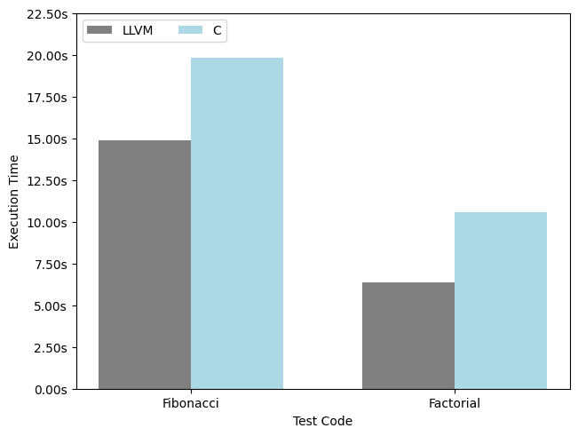

# Trivil LLVM compiler

Welcome to Trivil LLVM compiler repository. In this repository we showcase our thesis work done in order to change the Trivil compiler's back-end to use LLVM IR as a code generation target instead of C.

## Results

### Compilation Time

To evaluate the compilation time, 500 tests were randomly generated including various Trivil constructs. These tests were divided into 5 categories according to the code size. Here are the testing results:


### Execution Time

To evaluate the execution time, we run a dozen of times recursive Fibonacci code of 48 and Factorial code of 2,000,000,000 using llvm and c back-end compilers and got these results:



## Prerequisites

- GoLang
- Clang

## How to Build

To build the compiler simply run the compiler building script:

```bash
./build_compiler.sh
```

After that you will a file named `trivil_llvm`. This is your built compiler.

## How to Run

Just run the built compiler and pass to it the main file in the model to compile:

```bash
./trivil_llvm <PATH>
```

## Future Work

- Support for Additional Constructs:
  - Classes
  - Strings
  - Pattern matching select
- Real-World Application Testing